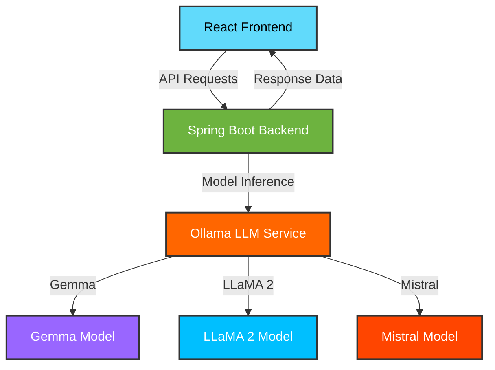

# 🦇 LLM Intelligence Console

<div align="center">


[](https://reactjs.org/)
[](https://spring.io/projects/spring-boot)
[![Powered by Ollama](https://img.shields.io/badge/Powered%20By-Ollama-FF6600?style=flat-square&logo=data:image/png;base64,iVBORw0KGgoAAAANSUhEUgAAABAAAAAQCAYAAAAf8/9hAAAACXBIWXMAAAsTAAALEwEAmpwYAAAErUlEQVQ4jU2TbVCUZxnHf9fz7LIPC7gsLOwLLAu4sryFuiBvKhpJGg3R2A61ai3NNDV+qKlOY9OZMY1T22k7fdEPdmw7mbEfOp1MTTVTjckwScUmhqRCQCIvKwu4LizvLMvuPvv0gTb9f77u//W7rvt/XRohBB6Ph9TUVLLZ7HNSSoQQnzkcjo+llFsNw6BcLi/5fL4LUspZgLF3717y+TxSSoQQCCG2lMvlVwEhhPha27ZNuVz+oWEYx9rb2/Hz8/MMDw8jlUJKidB1dF3/TjQaPeNyuYrArGVZE5VKZQG4LDZt2iSB3xWLxft37NgxMjExsffcuXM/qVt1BCGIRCL4/X4Mw0AIga7rCCEwTZNSqQTA/Rn9G4VC4RfxePzVcrnM3Nwcwe5u5ufn0ev1Os3NzUxOTuJ2uwmFQgghsCwL0zRxOBx4vV4ABgYGRDQa5ebNm9y8eRNd18lkMmQyGTweD52dndTrdVZXV3E6nTgcDizLwuFwIKXEsixM08Q0TeLx+P8SpJSUSiWEEAwNDSGlJJvN4vV6cblcOJ1OPB4P9Xqder2OZVlUKhVCoRB+v59KpYJt28iyLLxeL0oprly5gmmadHR0cOvWLXK5HH19fSilsG0bIQSmaWLbNrZtY9s2QgiEEKytrTE9PY3I5/OqpaVFBYNBmpqakFIipcTv95NKpbh27RrV9XWi0SjZ2Vnck0lGR0dRSiGEwDAMFhcXefz4Me3t7UQiEarVKpZlAWCFQqFGMpnUFxYWsCwL0zSZmJggFosha7XaH0qlkioUCmzbto2enh4SiQSDg4Pzw8PDz546depXa2trHDx4EN/ICH19fcVMJvODarU6k8vlji4tLTl6e3vVnj17XvX5fB/U6/WisCxLCSGIx+N6R0eHdnFpiWg0qk9NTdHc3MzKygr9/f309fVx4cIFRkdHicViDA0NMTk5yeHDh5mammJkZITu7m5Wr169evXq1bu6urpG9uzZc8zlcgHQkMlknlNK4Xa7WVhYoFQqsXPnTgBcLheGYSCEIJfLoZTCtm0cx4uDBw9SKpW4fPky+XyekZERbty4geM4xGKxT5ubmwEa8vn8H01DR2k6K6urXLt6lYMvvUSpVKK1tZVQKMTly5cJh8M0NTWxuLiIlJKOjg5mZmfZu3cvM9PT9Pf3H08kEi8/88wzL9br9b8LIUa0SCRCuVzGrdvs3r2b3bt3U61WqVQqlEolcrkce/bsQSmFEALD+MwbmUyGQqFAS0sLVmvrZ01NTT/X3W53yVpcxNvQQMvnnwfANE0cx+H+/fvMzc3R0NCAZVnkczlM08Dr9ZJMJpmenmb37t089dRTTE9Ps3XrVjZs2PC+5nK5SCQSBAKBYmsohGVZGIbB9PQ0TqeTeDyO4ziYpollWViWhdvtplQq8ejRI1544QXi8ThKKQKBANlsFiEE2uLiIocOHfrz3NzcK4FAYOfAwMAbx48fTwUCAVZWVigUCiil0DQNpRSO42BZFs3NzezatQuPx0Mul8NxHKLRKNVqFV8ggNbf309TU9NbLS0t9x48ePD+W2+9hcfjYX19nXfeeYeHDx+STCZJpVKcP3+e119/nXQ6zfHjx4nFYpw8eZJEIsGJEydobW3lxIkTAPwLrF/hixik+qMAAAAASUVORK5CYII=&logoWidth=20)](https://ollama.ai/)
[](https://opensource.org/licenses/MIT)

**✨ The ultimate platform for comparing and benchmarking multiple LLM models in real-time ✨**

[Features](#-features) • [Demo](#-demo) • [Installation](#-installation) • [Usage](#-usage) • [Architecture](#-architecture) • [Contributing](#-contributing)

</div>

<div align="center">
  
</div>

## ✨ Features

<div style="display:flex; justify-content:space-between; flex-wrap:wrap; margin-bottom:30px;">
  <div style="flex-basis:48%; border-left:4px solid #8A2BE2; padding-left:15px; margin-bottom:15px;">
    <h3>💠 Multi-Model Comparison</h3>
    <p>Compare responses from Gemma, LLaMA 2, and Mistral side-by-side with beautiful visual differentiation</p>
  </div>
  <div style="flex-basis:48%; border-left:4px solid #8A2BE2; padding-left:15px; margin-bottom:15px;">
    <h3>⚡ Real-time Performance Metrics</h3>
    <p>Track response times, token efficiency, and memory usage with interactive charts</p>
  </div>
  <div style="flex-basis:48%; border-left:4px solid #8A2BE2; padding-left:15px; margin-bottom:15px;">
    <h3>🤖 Interactive Chat Mode</h3>
    <p>Have dedicated conversations with each model featuring intelligent context maintenance</p>
  </div>
  <div style="flex-basis:48%; border-left:4px solid #8A2BE2; padding-left:15px; margin-bottom:15px;">
    <h3>📊 Detailed Analytics</h3>
    <p>Visualize performance differences between models with dynamic, exportable reports</p>
  </div>
</div>

<div style="display:flex; justify-content:space-between; flex-wrap:wrap;">
  <div style="flex-basis:48%; border-left:4px solid #8A2BE2; padding-left:15px; margin-bottom:15px;">
    <h3>🎨 Beautiful UI/UX</h3>
    <p>Sleek, animated interface with dark/light modes and customizable themes</p>
  </div>
  <div style="flex-basis:48%; border-left:4px solid #8A2BE2; padding-left:15px; margin-bottom:15px;">
    <h3>🔄 Smart Caching</h3>
    <p>Persistent history across sessions with intelligent memory management</p>
  </div>
  <div style="flex-basis:48%; border-left:4px solid #8A2BE2; padding-left:15px; margin-bottom:15px;">
    <h3>⚙️ Customizable Settings</h3>
    <p>Fine-tune parameters for each model with intuitive controls and presets</p>
  </div>
  <div style="flex-basis:48%; border-left:4px solid #8A2BE2; padding-left:15px; margin-bottom:15px;">
    <h3>🛠️ Developer-Friendly</h3>
    <p>Clean architecture with extensive documentation and plugin support</p>
  </div>
</div>

<div align="center">
  <br/>
  
  <br/><br/>
</div>

## 🎬 Demo

<div align="center">
  
  <br/><br/>
</div>

<div style="background: linear-gradient(45deg, #8A2BE2, #4B0082); padding: 25px; border-radius: 15px; color: white; margin: 20px 0; box-shadow: 0 10px 30px rgba(138,43,226,0.3);">
  <h3 style="color: white; margin-top: 0;">💫 Experience the Power of Multiple Models</h3>
  <p>The LLM Intelligence Console provides real-time comparison and analysis of multiple language models with beautiful animations and visualizations that make AI benchmarking a delight:</p>
  
  <ul style="list-style-type: none; padding-left: 10px;">
    <li style="margin: 15px 0;">🔍 <strong>Compare Mode</strong> - Send the same prompt to all models simultaneously and watch responses generate in real-time</li>
    <li style="margin: 15px 0;">💬 <strong>Chat Mode</strong> - Have dedicated conversations with individual models with animated message bubbles</li>
    <li style="margin: 15px 0;">🏆 <strong>Performance Ranking</strong> - Automatically identifies the fastest and most token-efficient model with dynamic leaderboards</li>
    <li style="margin: 15px 0;">📈 <strong>Visual Analytics</strong> - Interactive charts and graphs for deep performance insights</li>
  </ul>
</div>

## 🚀 Installation

### Prerequisites

<div style="display:flex; justify-content:space-around; flex-wrap:wrap; margin: 20px 0;">
  <div style="text-align:center; margin:10px;">
    
    <p><a href="https://nodejs.org/">Node.js</a> (v16+)</p>
  </div>
  <div style="text-align:center; margin:10px;">
    
    <p><a href="https://www.oracle.com/java/technologies/javase-downloads.html">Java</a> (JDK 17+)</p>
  </div>
  <div style="text-align:center; margin:10px;">
    
    <p><a href="https://maven.apache.org/">Maven</a></p>
  </div>
  <div style="text-align:center; margin:10px;">
    
    <p><a href="https://ollama.ai/">Ollama</a></p>
  </div>
</div>

### Frontend Setup

```bash
# Clone the repository
git clone https://github.com/yourusername/llm-intelligence-console.git
cd llm-intelligence-console/frontend

# Install dependencies
npm install

# Start development server
npm start
```

### Backend Setup

```bash
# Navigate to backend directory
cd ../backend

# Build with Maven
mvn clean install

# Run the Spring Boot application
mvn spring-boot:run
```

### Model Setup with Ollama

```bash
# Install required models
ollama pull gemma
ollama pull llama2
ollama pull mistral
```

<div align="center">
  
</div>

## 💻 Usage

<div style="background: linear-gradient(to right, #8A2BE2, #4B0082); padding: 5px; border-radius: 10px; margin: 20px 0;">
  <div style="background: white; border-radius: 5px; padding: 20px;">
    <ol>
      <li><strong>Launch the application</strong> by starting both frontend and backend servers</li>
      <li><strong>Select your mode</strong>:
        <ul>
          <li><strong>Compare Mode</strong>: Write a prompt to see how each model responds</li>
          <li><strong>Chat Mode</strong>: Have an ongoing conversation with a specific model</li>
          <li><strong>Benchmark Mode</strong>: Run standardized tests across all models</li>
        </ul>
      </li>
      <li><strong>Analyze results</strong> - Review interactive performance statistics and response quality metrics</li>
      <li><strong>Save favorite prompts</strong> for later use in your personal library</li>
      <li><strong>Export results</strong> as PDF, CSV, or interactive HTML reports</li>
    </ol>
  </div>
</div>

<div align="center">
  
</div>

## 🧰 Architecture

<div align="center" style="margin: 30px 0;">



</div>

### Tech Stack

<div style="display: flex; flex-wrap: wrap; justify-content: center; gap: 20px; margin: 30px 0;">
  <div style="flex-basis: 23%; text-align: center; padding: 20px; border-radius: 10px; background: rgba(138,43,226,0.1); box-shadow: 0 5px 15px rgba(0,0,0,0.05);">
    <h3>Frontend</h3>
    <p>React, Framer Motion, TailwindCSS, Three.js</p>
  </div>
  <div style="flex-basis: 23%; text-align: center; padding: 20px; border-radius: 10px; background: rgba(138,43,226,0.1); box-shadow: 0 5px 15px rgba(0,0,0,0.05);">
    <h3>Backend</h3>
    <p>Spring Boot, WebFlux, Redis Cache</p>
  </div>
  <div style="flex-basis: 23%; text-align: center; padding: 20px; border-radius: 10px; background: rgba(138,43,226,0.1); box-shadow: 0 5px 15px rgba(0,0,0,0.05);">
    <h3>Models</h3>
    <p>Ollama, Hugging Face Integration</p>
  </div>
  <div style="flex-basis: 23%; text-align: center; padding: 20px; border-radius: 10px; background: rgba(138,43,226,0.1); box-shadow: 0 5px 15px rgba(0,0,0,0.05);">
    <h3>API</h3>
    <p>RESTful JSON, WebSockets for streaming</p>
  </div>
</div>

## 📝 API Reference

### Main Endpoints

<div style="background: #f5f5f5; padding: 20px; border-radius: 10px; margin: 20px 0; box-shadow: inset 0 0 10px rgba(0,0,0,0.05);">

```
POST /api/prompt/{model}    - Submit prompt to specific model
POST /api/compare           - Submit same prompt to all models
GET  /api/models            - List available models
GET  /api/health            - Check service health
GET  /api/stats             - Retrieve performance statistics
```

</div>

## 🤝 Contributing

<div style="background: linear-gradient(to right, #8A2BE2, #4B0082); color: white; padding: 25px; border-radius: 15px; margin: 20px 0; box-shadow: 0 10px 25px rgba(138,43,226,0.3);">

Contributions are what make the open source community such an amazing place to learn, inspire, and create. Any contributions you make are **greatly appreciated**.

1. Fork the Project
2. Create your Feature Branch (`git checkout -b feature/AmazingFeature`)
3. Commit your Changes (`git commit -m 'Add some AmazingFeature'`)
4. Push to the Branch (`git push origin feature/AmazingFeature`)
5. Open a Pull Request

</div>

<div align="center">
  
</div>

## 📜 License

Distributed under the MIT License. See `LICENSE` for more information.

## 👏 Acknowledgments

<div style="display: flex; flex-wrap: wrap; justify-content: center; gap: 15px; margin: 20px 0;">
  <div style="flex-basis: 30%; text-align: center; padding: 15px; border-radius: 10px; background: rgba(138,43,226,0.1); box-shadow: 0 5px 15px rgba(0,0,0,0.05);">
    <h4>Ollama Team</h4>
    <p>For the amazing local LLM runtime</p>
  </div>
  <div style="flex-basis: 30%; text-align: center; padding: 15px; border-radius: 10px; background: rgba(138,43,226,0.1); box-shadow: 0 5px 15px rgba(0,0,0,0.05);">
    <h4>Open Source Models</h4>
    <p>All the language models that make this possible</p>
  </div>
  <div style="flex-basis: 30%; text-align: center; padding: 15px; border-radius: 10px; background: rgba(138,43,226,0.1); box-shadow: 0 5px 15px rgba(0,0,0,0.05);">
    <h4>AI Community</h4>
    <p>For continuous innovation and inspiration</p>
  </div>
</div>

---

<div align="center">
  
  <br/>
  <h3>⭐ Don't forget to star this repo if you found it useful! ⭐</h3>
  <br/>
  <p>Made with ❤️ by <strong>KISHORE RAM M</strong></p>
  
  <div style="margin-top: 30px;">
    <a href="https://github.com/yourusername" style="text-decoration: none; margin: 0 10px;">
      
    </a>
    <a href="https://twitter.com/yourusername" style="text-decoration: none; margin: 0 10px;">
      
    </a>
    <a href="https://linkedin.com/in/yourusername" style="text-decoration: none; margin: 0 10px;">
      
    </a>
  </div>
</div>
